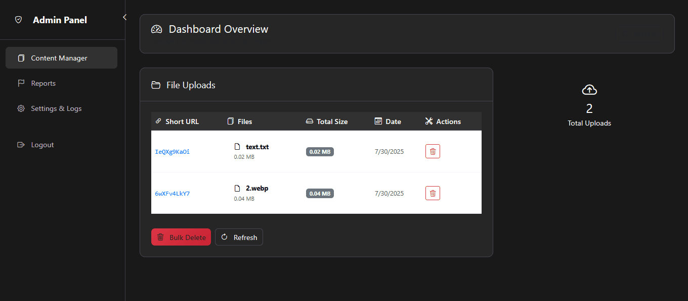

# 📁 Temp-File.Cloud File Sharing Service

[](#)
[](#)
[](#)
[](#)

**Built by Devency Agency**  
A **source‑available** Flask app for secure, time‑limited file sharing. Core logic has been redacted; the client has granted us permission to semi‑open‑source this project, which is running live at [temp-file.cloud](https://temp-file.cloud).


## 🔑 Features

- **Unique download links** per upload  
- **Auto‑expiring directories** (configurable TTL)  
- **CAPTCHA‑protected** upload endpoint  
- **JWT‑secured** file uploads  
- **Simple file browser** & download UI  
- **Extensible service layer** (public stubs)


## 🚀 Live Site

Visit the live service at:  
https://temp-file.cloud


## ⚙️ Environment Variables

`config.example.py` can load these from your environment:

```bash
export SECRET_KEY="your-secret-key"
export JWT_SECRET_KEY="your-jwt-secret"
export CAPTCHA_SECRET_KEY="your-recaptcha-secret"
```


## 📖 Usage / Examples

### Upload a file

```http
POST /api/upload
Authorization: Bearer <JWT_TOKEN>
Content-Type: multipart/form-data

files: [your_file.png, ...]
```

**Response:**

```json
{
  "status": "success",
  "url": "9d91a1f2e5",
  "qr": "<base64‑png>"
}
```

### Browse & Download

* **Browse**: `GET /9d91a1f2e5/`
* **Download**: `GET /9d91a1f2e5/your_file.png`


## 📜 API Reference

#### Verify CAPTCHA & Get JWT

```http
POST /api/captcha
Content-Type: application/json

{
  "g-recaptcha-response": "<token>"
}
```

| Parameter              | Type     | Description                   |
| :--------------------- | :------- | :---------------------------- |
| `g-recaptcha-response` | `string` | **Required.** reCAPTCHA token |

**Response:**

```json
{
  "status": "success",
  "access_token": "<JWT_TOKEN>"
}
```

## 🔧 Admin Panel

Manage your service in one place.

> View file uplaoded along with contact-us messages.

## 📂 Folder Structure

```text
.
├── app/                 # Flask application
│   ├── routes/          # Blueprint endpoints (stubs only)
│   ├── services/        # Core logic (redacted; raises NotImplementedError)
│   ├── templates/       # Jinja2 templates for upload/download/error pages
│   ├── static/          # CSS, JS, icons
│   └── __init__.py
├── example_config.py    # Template for config.py
├── requirements.txt     # Python dependencies
└── README.md            # This file
```


## 🤝 Contributing

Contributions welcome!
Please open an issue or submit a pull request.
*Core modules remain stubbed in this public repo.*


## 📜 License

This repository is **source‑available** under the MIT License.
Core security-sensitive modules and the admin panel are **proprietary** and not included here.
See [`LICENSE`](./LICENSE) for details.


## 📫 Private Access & Licensing

For the complete, production‑ready codebase, email us at **[info@devency.net](mailto:info@devency.net)** for licensing options or private repo access.

## 🛣️ Roadmap

* [ ] Role‑based admin dashboard (private)
* [ ] Automated tests & CI/CD pipeline


## 👤 Authors

**Devency Agency**  
🌐 [https://devency.net](https://devency.net)  
✉️ [info@devency.net](mailto:info@devency.net)  


## 🏷️ Badges


*Thank you for exploring our source‑available project!* 🚀
